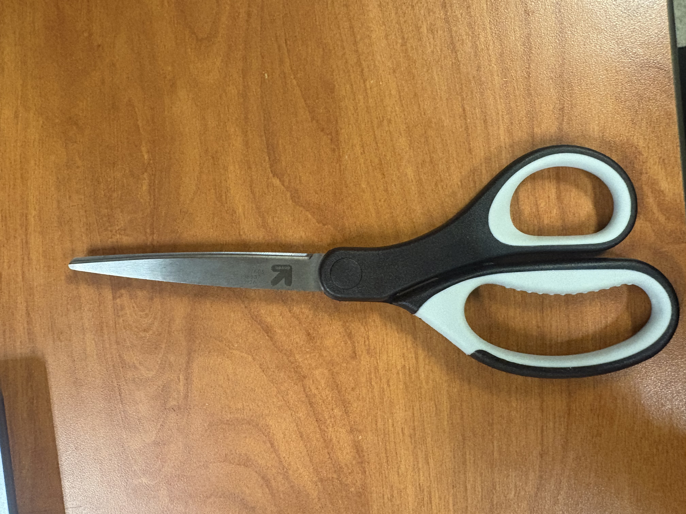
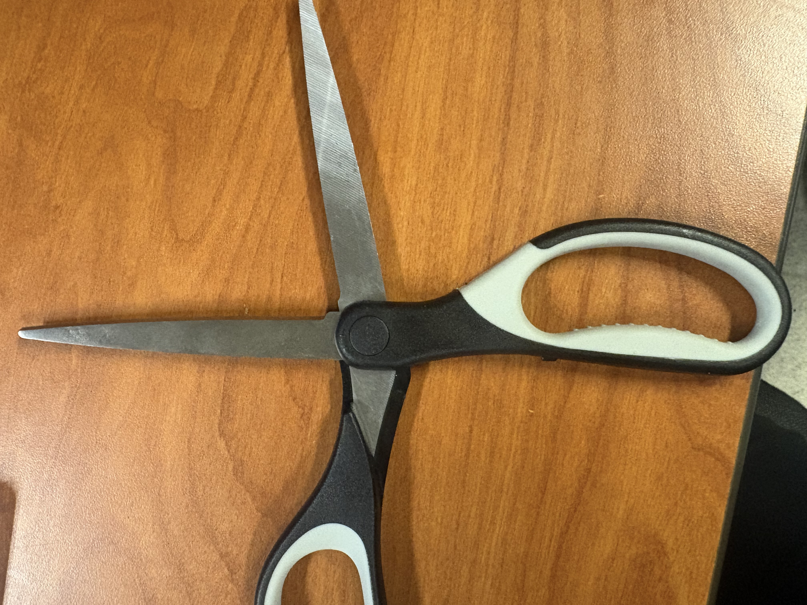
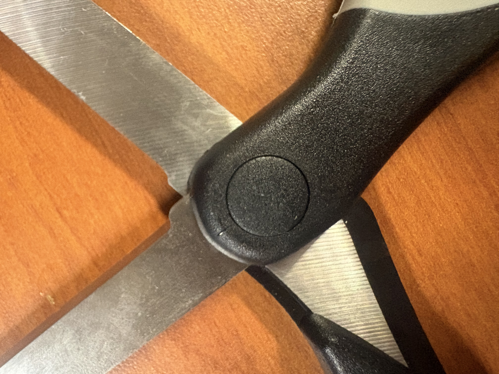

# A1 – [Topic]

## Objective
The objective of this assignment is to develop and demonstrate the ability to clearly communicate engineering decisions, methods, and results through the creation and evaluation of an engineering portfolio. This assignment also provides experience in designing and organizing a portfolio that effectively showcases and documents engineering work, helping build skills that can be applied to developing and maintaining a professional engineering portfolio in the future.
## Analyze
Task A: 
Portfolio 1-  https://nhoong.github.io/index.html
	This portfolio is laid out very well. They provide a lot of information that is not organized as proficiently as it could be. It has two separate pages: the first is an introduction and all of their engineering projects, while the second is all of their work experience. To make it more organized and easier to navigate, let's add one more page for their engineering projects. This would be clearer for a user viewing their portfolio for the first time. None of their engineering projects could be replicated from the information provided. They only provide pictures and a short description of projects; only their capstone project has a link to a report about what they had done. Only their capstone project shows reasoning, decision-making, and the final answer. However, if you did not read their final report on the project, which is listed, you would not be able to see the reasoning and decision-making. The only information provided for the rest of the engineering projects is the original objective and the final product.Their use of technical terms is appropriate if any employer were to find their profile. However, the information they have provided is not enough to give a full overview of the engineering project it is describing. 

Portfolio 2- https://instructure.charlotte.edu/eportfolios/4011/Home
	This portfolio is efficiently organized, and you could find any information you are looking for in 60 seconds or less. All the information is correctly labeled to what it is linked to. The engineering projects are well documented and all the information provided is orginized. You could recreate this portfolio using canvas and their is adequate amount of information to recreate any of the projectes that are documented. In all of the engineering projects all of the reasoning, decision making, and final project are given. The use of technical language is well used and makes sense within the projects it is being used in. The engineering language used is acceptable if an employer were to look at this portfolio. 

## Decide
Task B:  Product Analysis 
Part Choosen- Scissors

a.) To cut through things 
b.) A simple model is the moment (torque) equation: M=Fd
      i.)   where:
M = torque/moment produced about the pivot (N·m)
F = force applied by the user's hand to the handle (N)
d = perpendicular distance from the pivot to where the force is applied (m)
    ii.)  The scissors rotate about the pivot point, converting the force applied at the handles into a cutting force at the blades.
c.)  

Blades: The blades apply a shearing force to the material being cut. When the handles are squeezed, the blades rotate around the screw and concentrate force along the inside edge of the blade, causing the material to shear and separate. 

Screw: The screw acts as the pivot point of the scissors. It holds the two blades together and allows them to rotate when force is applied to the handles. 
d.)  Inventor- Andrew John Stokes 
     Patent number- US6493947B2 
https://patents.google.com/patent/US6493947B2/en?oq=us+6493947b2
i.)  Utility knife – uses a sharp blade to cut materials such as paper, cardboard, and plastic.
 Paper cutter – uses a hinged blade to cut paper with a downward shearing motion.
ii. ) One important design decision described in the patent is the use of different materials in the thumb and finger bows. The patent states that the forward part of the thumb bow is made from a rigid material, while the rearward part is made from a form-stable but flexible material. I think the engineer made this choice to make the scissors more comfortable to use while still maintaining their strength. The rigid material near the pivot provides structural support, while the flexible material around the finger/thumb opening can provide some flexibility and comfort when the user squeezes the handles.

## Communicate

