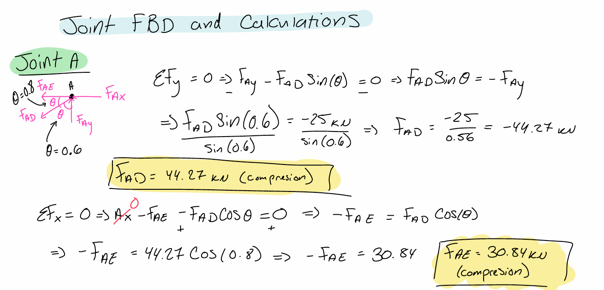
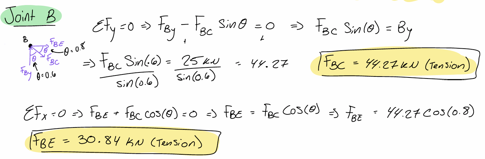
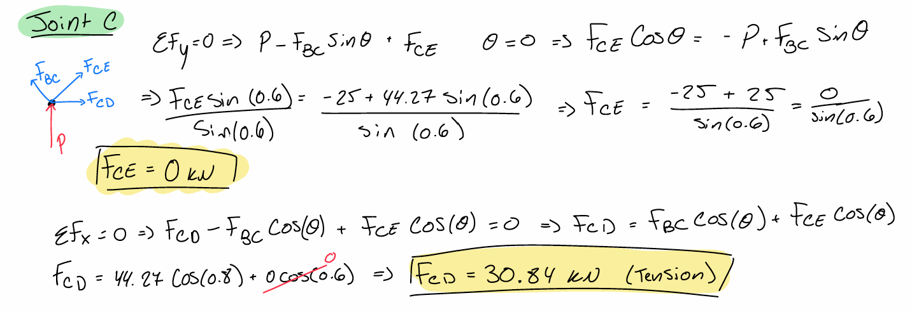
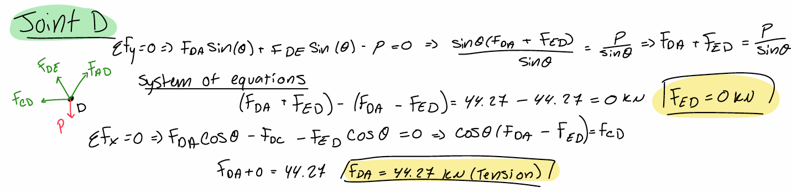
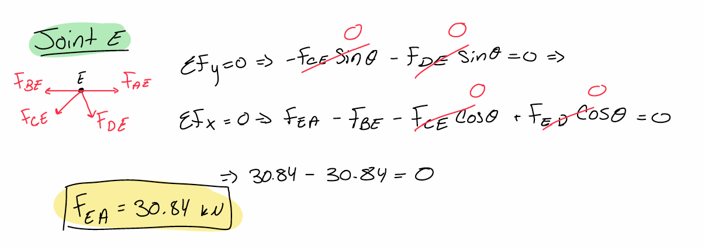
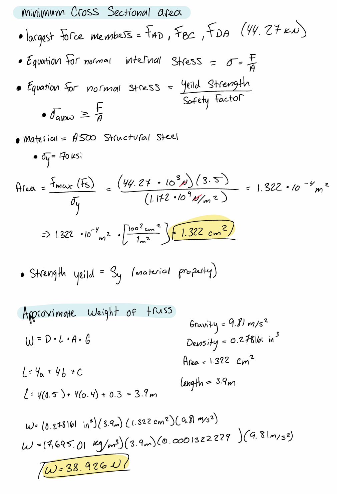
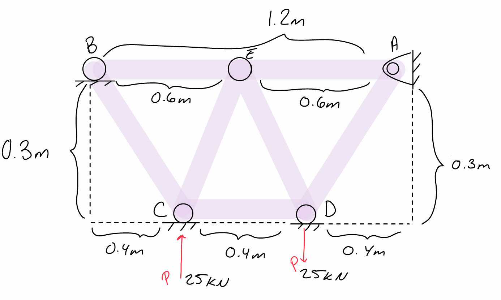
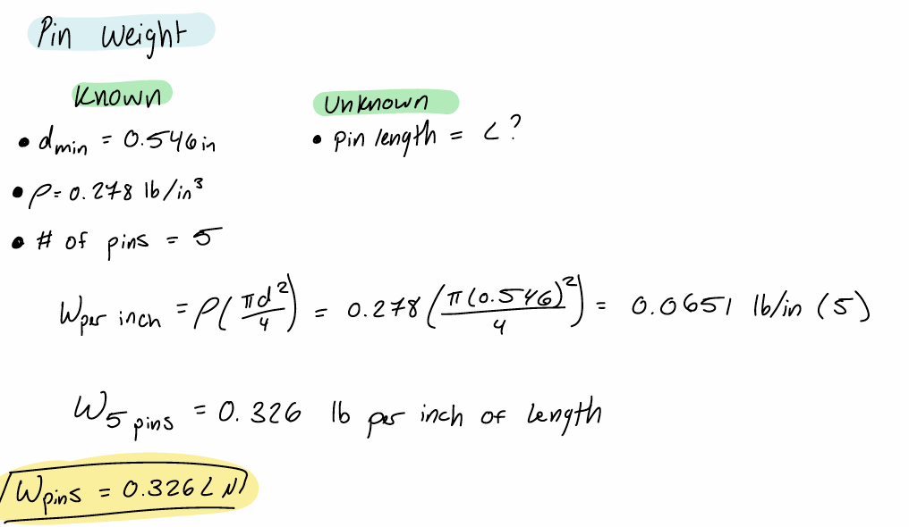
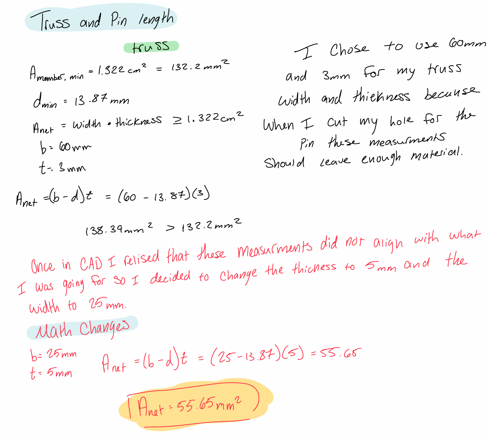

# A2 – Truss Stress Analysis

## Objective

The objective of this project is to design a lightweight planar truss that can support the required loading while maintaining structural integrity and the required factor of safety. The design process includes determining the internal forces in each truss member, sizing the members and connecting pins, estimating the weight, and verifying the design using CAD. The final design will be compared to the analytical calculations to evaluate the accuracy of the design.

### Design Requirements

- Applied load, P: 25 kN
- a = 0.4 m
- b = 0.3 m
- Point A: Pin support
- Point B: Roller support
- Truss material: A500 structural steel
- Truss safety factor: 3.5
- Pin material: Hardened tool steel
- Pin shear yield strength: 170 ksi
- Pin safety factor: 4
- Pin density: 0.278 lb/in³
- Number of pins: 5

## Analyze

### 1. Initial Truss Geometry

The initial sketch established the truss's overall geometry and identified the required dimensions, loading locations, and support conditions. At this stage, the goal was to develop a simple and stable layout that could be analyzed using the method of joints. This sketch served as the starting point for evaluating the geometry and making changes before selecting the final truss design.

### 2. Final Truss Geometry and Overall Truss FBD with Reaction Forces Calculations

The final truss geometry was selected based on structural stability, simplicity, and weight. The geometry meets the required dimensions and support conditions while providing a simple layout that is easy to manufacture and analyze. This final design was used for the remaining calculations, including member forces, cross-sectional sizing, pin sizing, and total weight.

- a = 0.4 m

- b = 0.3 m
  
- Applied loads = 25 KN
  
- Ax = 0 KN
  
- Ay = 25 KN
  
- By = 25 KN
  
### 3. Joint Analysis 

### Joint Free-Body Diagrams

#### Joint A

#### Joint B

#### Joint C

#### Joint D

#### Joint E

The free-body diagrams for each joint were created to determine the internal forces in each truss member. Starting with the known support reactions, the method of joints was used by applying the equilibrium equations, \(\sum F_x=0\) and \(\sum F_y=0\), at each joint. The calculated member forces were then used to identify whether each member was in tension or compression and to determine the largest internal force in the truss.

Analyzing the joints individually also provided a way to verify that the truss remained in equilibrium throughout the analysis. The results from each joint were carried forward to the next joint until all member forces were determined. These forces were then used in the member sizing and stress calculations to select a cross-sectional area that satisfies the required factor of safety.

The joint analysis determined the force carried by each member and whether the member was subjected to tension or compression. The largest calculated member force was used as the critical loading condition for sizing the truss members. This result was then carried into the stress analysis to determine the minimum required cross-sectional area while maintaining the specified factor of safety.

### 4. Truss Member Sizing

The calculations above were used to determine the required cross-sectional area of the truss members based on the largest internal force and the required factor of safety. The resulting area was then used to select the member cross-section for the final design. Finally, the lengths and cross-sectional areas of the members were used to calculate the estimated weight of the truss.

### 5. Final Truss Geometry 

The calculated minimum cross-sectional area was used to select the final geometry of the truss members. The selected cross-section provides enough area to withstand the maximum member force while maintaining the required factor of safety. This cross-section was then used for the final truss design and CAD model.

### 6. Pin Design

The largest force acting on a pin was 44.27 kN. This force was used with the specified 170 ksi shear yield strength and a factor of safety of 4 to determine the minimum required pin area and diameter. The calculated diameter was then used to determine the weight of the five pins in the final design.

### 7. Pin Area to Diameter 

The minimum required pin area was converted into a diameter to determine the smallest practical cylindrical pin size for the design. Using the area of a circle, the calculated minimum diameter was approximately **0.546 in**. This diameter provides the required cross-sectional area to withstand the maximum shear force while maintaining the specified factor of safety.

### 8. Pin Weight 

The pin weight was calculated using the selected pin diameter, pin length, number of pins, and the density of the hardened tool steel. The volume of each cylindrical pin was determined first, and the total volume of all five pins was then used to calculate their combined weight. This weight was added to the overall truss weight when evaluating the final design.

### 9. Truss and Pin Lengths

The initial truss dimensions were determined through the hand calculations before creating the CAD model. After modeling the calculated geometry in CAD, I noticed that the original B and T dimensions did not produce the expected truss geometry. I then adjusted these dimensions to better match the intended design while maintaining the required structural constraints. The final truss and pin dimensions shown below reflect these changes made after reviewing the CAD model.

### 10. Truss and Pin Total Weight and Mass

The pin diameter was determined from the minimum required cross-sectional area calculated from the maximum shear force and the required factor of safety. The minimum calculated diameter was then used as the basis for selecting the final pin size. The pin length was determined from the dimensions of the truss connection in CAD so that the pin properly passes through the connected members and provides an adequate connection. These final pin dimensions were used in the CAD model and final pin weight calculations.

### 11. CAD Model 

### 12. CAD Mass Properties 

### 13. Hand Calculations vs. CAD

## Communicate
### 14. Design Summary

### 15. Engineering Lessons Learned

### 16. Final Design

### 17. CAD Download

