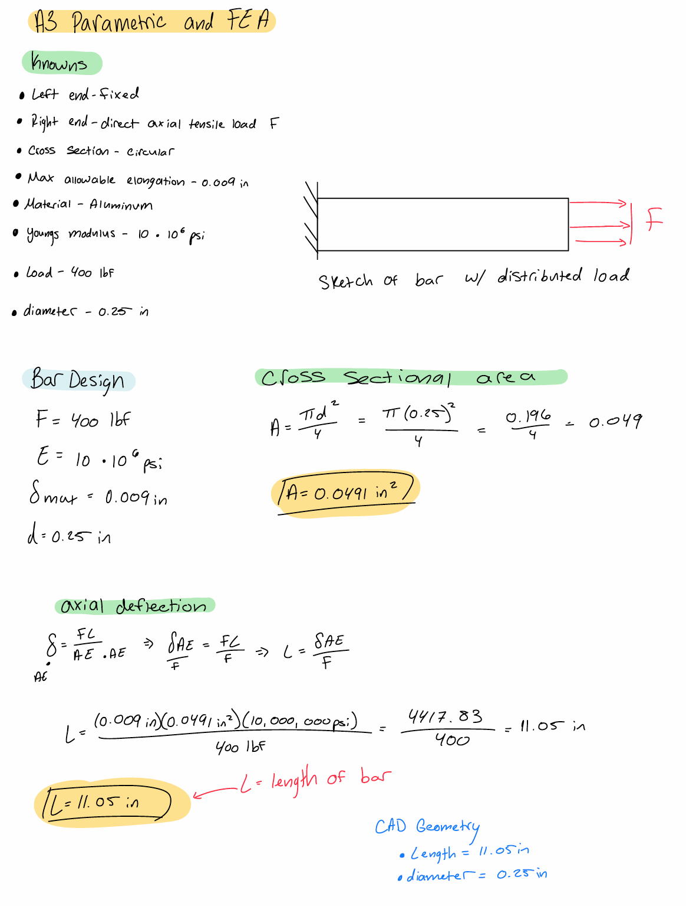
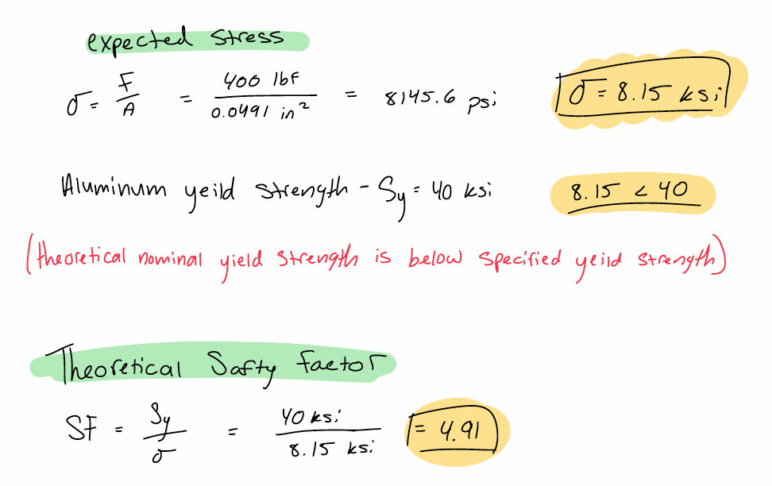
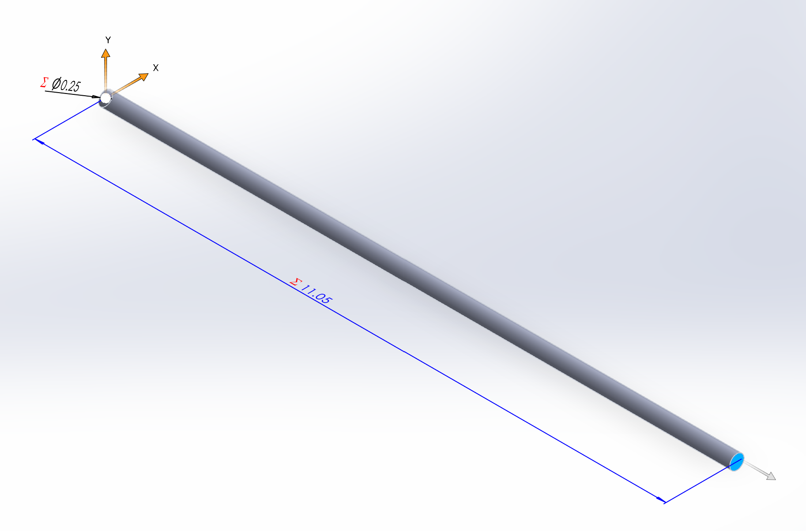
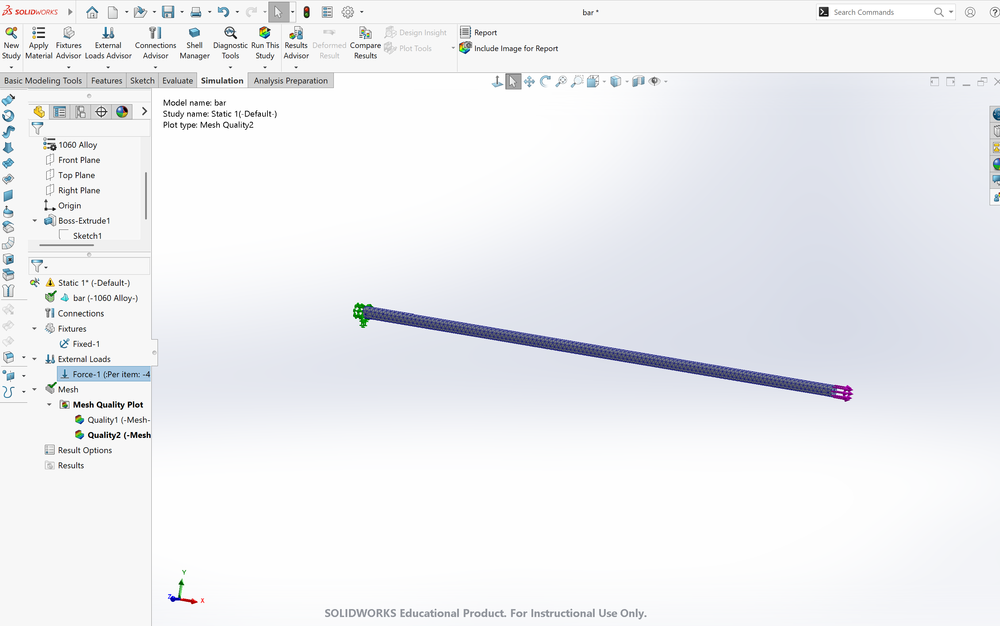
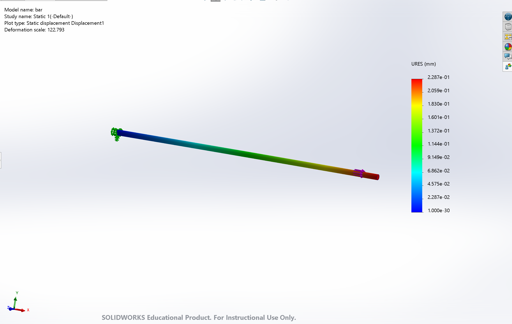
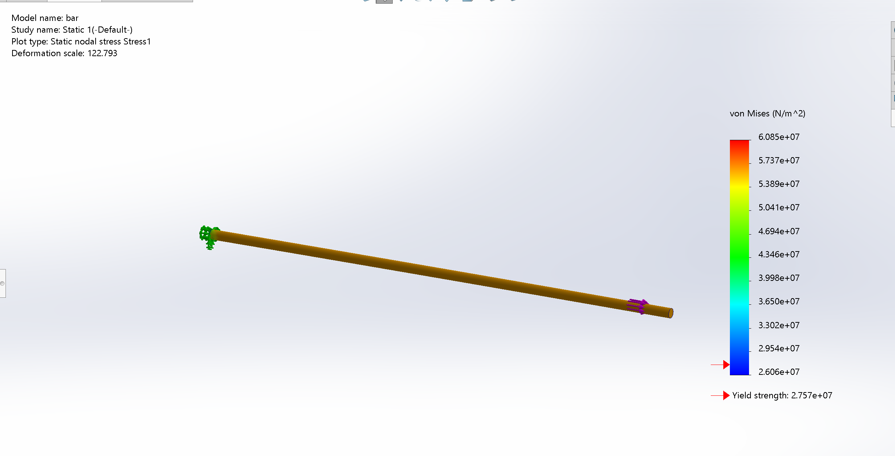
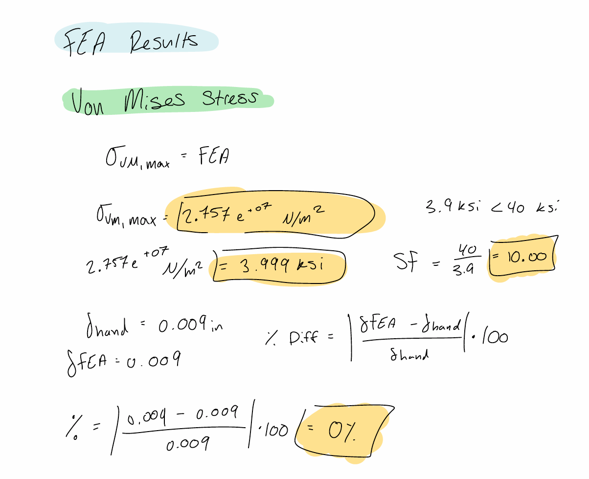
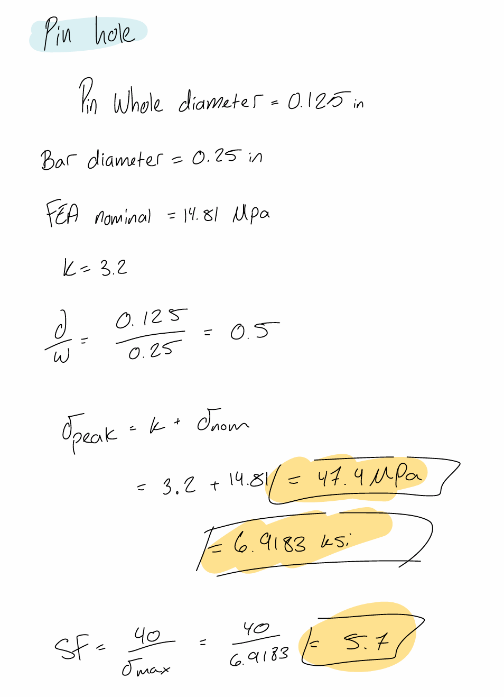

# A3 – [Topic]

## Objective

The purpose of this assignment is to design an aluminum bar subjected to direct axial tension using parametric modeling and finite element analysis (FEA). The design must satisfy a maximum axial deflection of 0.009 inches while using a load between 300 and 500 lbf. A circular cross section was selected for the bar, and the required length was determined using the direct tension elongation equation. The resulting geometry was then created parametrically in CAD so that changes to the design parameters would automatically update the bar's dimensions. Finally, FEA was used to verify the axial deflection and stress of the design and to compare the FEA results with the analytical calculations.

## Analyze

### Initial Design Parameters

The first step was to determine the design parameters for the bar. A load of 400 lbf was selected because it falls within the required range of 300 to 500 lbf. A Young's modulus of \(10\times10^6\) psi was selected, which is within the specified aluminum range of \(8.5\times10^6\) to \(11.5\times10^6\) psi. The maximum allowable axial deflection was set to 0.009 inches. A circular cross section with a diameter of 0.25 inches was selected for the bar.

For the Cross-Sectional Area, a circular cross section was selected based on the geometry shown in the assignment. The bar diameter was selected as 0.25 inches. The cross-sectional area was calculated using the area equation for a circle. The resulting area was then used in the direct tension elongation equation to determine the required length of the bar.

The direct tension elongation equation was used to determine the required length of the bar. The maximum allowable axial deflection was known to be 0.009 inches. Since the applied force, cross-sectional area, Young's modulus, and maximum allowable deflection were known, the equation was rearranged to solve for the length.The analytical calculation resulted in a required bar length of approximately 11.05 inches. This length was then used as the basis for the parametric CAD model.

The nominal stress in the bar was also calculated to provide a theoretical value to compare with the FEA results. The calculated nominal stress of approximately 8.15 ksi is below the specified aluminum yield strength of 40 ksi. The theoretical safety factor was then calculated. This indicates that the initial analytical design is below the specified yield strength.

### Parametric CAD Analysis

The calculated design parameters were then incorporated into the CAD model using parametric equations. The force, Young's modulus, maximum allowable deflection, diameter, cross-sectional area, and length were defined as parameters. The cross-sectional area was calculated from the diameter, while the length was calculated using the axial deflection equation. Linking these values together allows the model to automatically update when a design parameter is changed. The final analytical geometry was a circular bar with a diameter of 0.25 inches and a calculated length of approximately 11.05 inches.

### FEA Setup

The completed CAD model was then prepared for finite element analysis. The left end of the bar was fixed to represent the support shown in the assignment, while a 400 lbf tensile load was applied to the opposite end in the axial direction. The aluminum material was assigned using the selected Young's modulus of \(10\times10^6\) psi. A mesh was then generated over the model before running the simulation.

## Decide

### FEA Deflection

The FEA displacement analysis was used to determine the actual axial deflection of the bar under the 400 lbf tensile load. The fixed end remained constrained while the largest displacement occurred toward the loaded end of the bar.

The maximum deflection obtained from the FEA was: 0.009 inches. 

This value will be compared with the analytical deflection limit of 0.009 inches.

### FEA Von Mises Stress

A von Mises stress analysis was performed to determine the stress distribution throughout the bar. Because the bar has a uniform circular cross section and is subjected to direct axial tension, the stress away from the constrained region is expected to be relatively uniform.

The maximum von Mises stress obtained from the FEA was: 2.757 * 10^7 N/m^2

The maximum stress was compared with the specified aluminum yield strength of 40 ksi.

The maximum FEA stress was 3.999 ksi, which is below the specified yield strength of 40 ksi. Therefore, the design passes the strength requirement with a safety factor of 10.

### Analytical vs. FEA Deflection

The analytical calculation predicted a maximum axial deflection of 0.009 inches. The FEA simulation produced a maximum deflection of 0.009 inches. The analytical and FEA results are expected to be relatively close because the bar has a simple, uniform circular cross section and is subjected to direct axial loading. The analytical equation assumes uniform axial stress and deformation, which closely represents the conditions used in the FEA model. Any difference between the two results may be caused by factors such as mesh density, boundary conditions, material-property inputs, or assumptions made in the analytical calculation.

For this simple geometry, the analytical solution provides a reliable prediction of the axial deflection. However, FEA would be more useful for a more complicated geometry because it can account for local effects such as holes, fillets, and stress concentrations.

### Pin-Hole Stress Concentration

A substantial pin hole on the left side of the bar was considered as a possible design modification. A hole creates a geometric discontinuity that causes the local stress to increase above the nominal stress in the bar. Instead of performing another FEA simulation, a stress concentration factor, \(K_t\), was used to estimate the peak stress around the hole.

Based on this calculation, the estimated stress at the pin hole is 6.91 ksi, and the resulting safety factor is 5.7. Therefore, the design with the assumed pin hole [would/would not] satisfy the 40 ksi yield-strength requirement.

We'll fill in the actual \(K_t\) once you have the hole dimensions/reference chart.

## Communicate

### Design Reflection

This assignment demonstrated how analytical calculations, parametric CAD, and finite element analysis can be combined during the engineering design process. The axial deflection equation was first used to determine the required length of the aluminum bar. The resulting dimensions were then incorporated into a parametric CAD model, allowing the geometry to automatically update when the design parameters were changed. FEA was then used to verify the deformation and stress of the completed design.

Comparing the analytical and FEA results demonstrated the advantages of using both methods. The analytical equation provides a quick and effective way to predict the behavior of a simple bar under direct axial loading, while FEA provides a more detailed representation of stress and displacement throughout the component. The pin-hole analysis also demonstrated how geometric discontinuities can create stress concentrations and significantly increase local stresses.

### Lessons Learned

Through this assignment, I learned how changes in load, geometry, and material properties affect the deformation and strength of a component. I also learned how parametric CAD can connect engineering calculations directly to model dimensions. Instead of manually entering a final length, the length was calculated from the selected design parameters, making the model easier to modify and evaluate.

I also learned how FEA can be used to verify analytical calculations. For a simple bar under direct axial tension, the analytical solution provides a good prediction of the expected deformation. FEA provides additional information about the stress and displacement distribution and becomes especially useful when a component has a more complicated geometry.

Another important lesson was the effect of stress concentrations. A hole can significantly increase the local stress even when the nominal stress in the bar is relatively low. This demonstrates why geometric features must be considered when evaluating the safety of an engineering design.

### Time Spent

The total time spent completing this assignment was around 2 hours and 30 minutes. This included the time spent reviewing the assignment, completing the analytical calculations, creating the parametric CAD model, setting up the FEA, analyzing the results, and documenting the design process.

### Final Conclusion

The aluminum bar was designed using analytical axial-deflection calculations, parametric CAD modeling, and finite element analysis. The selected design uses a 400 lbf tensile load, a Young's modulus of \(10\times10^6\) psi, a maximum allowable deflection of 0.009 inches, and a 0.25-inch circular diameter. The analytical calculation resulted in a bar length of approximately 11.05 inches. The parametric CAD model was then created using these design relationships, allowing the geometry to update when the design parameters were changed. FEA was used to verify the deflection and stress of the design. The comparison between the analytical and FEA results demonstrates how both methods can be used together to evaluate and improve an engineering design.

### CAD Download

[Download CAD Files](bar.zip)

