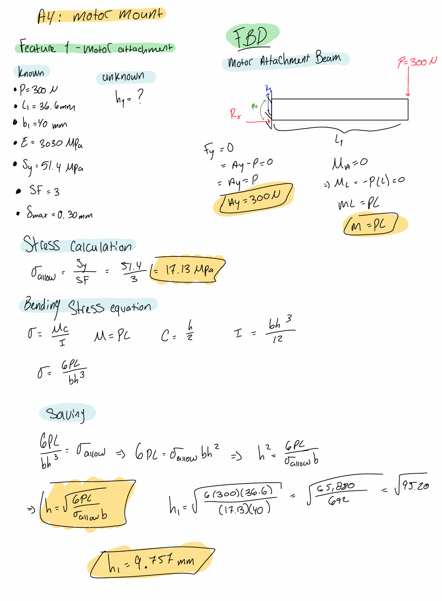
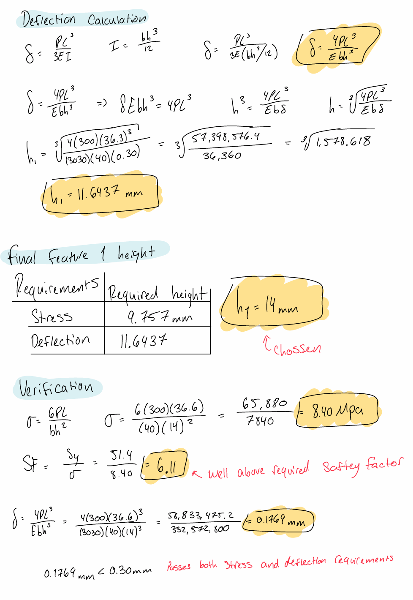
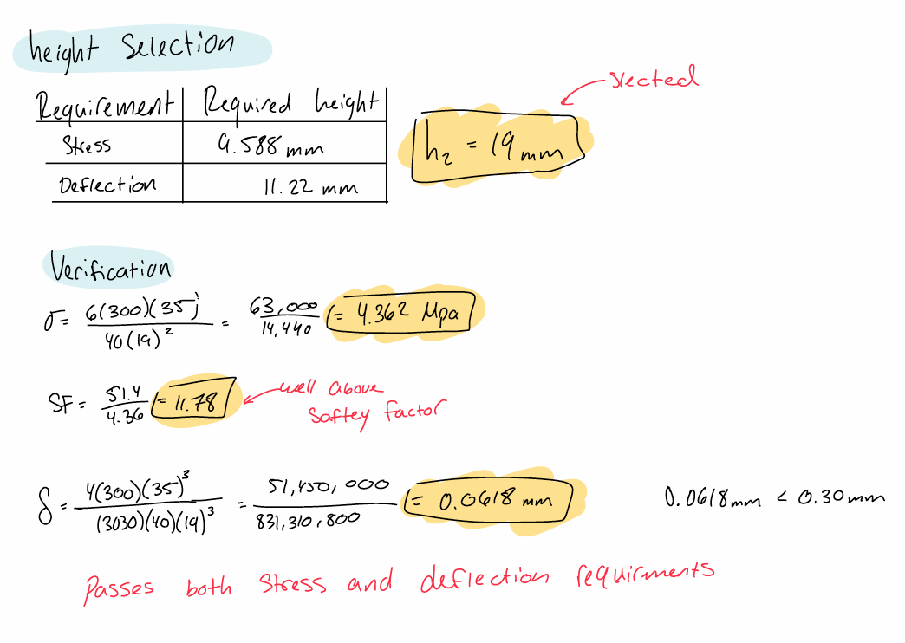
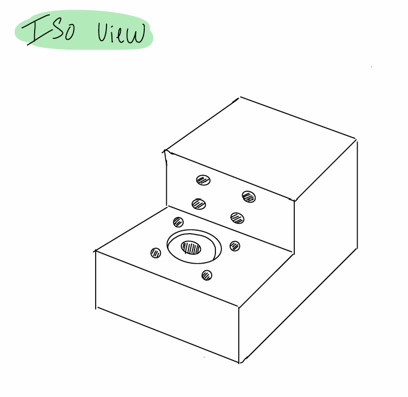
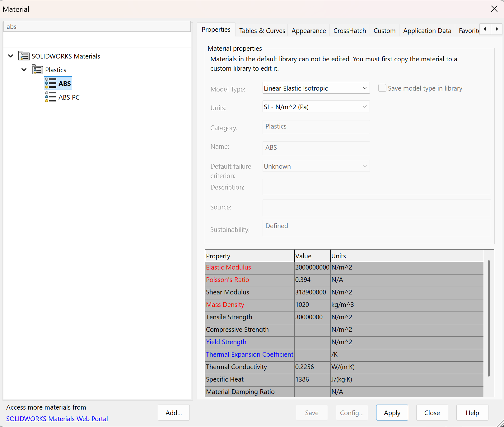
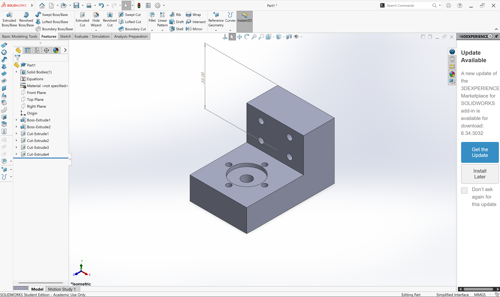
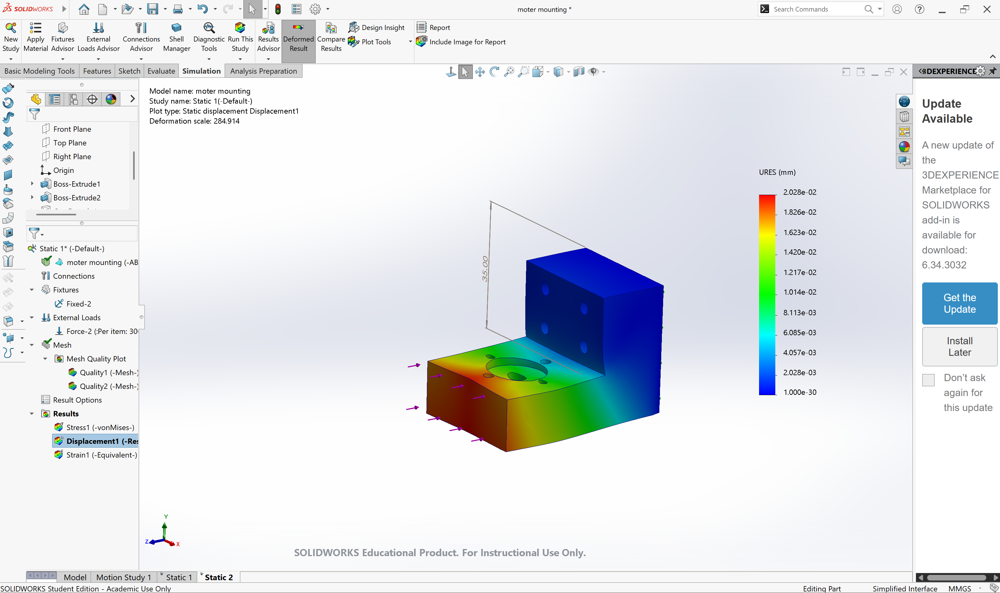

# A4 – [Topic]

## Objective

The purpose of this assignment is to design a motor mount for a Brushed 24V DC Gear Motor. The motor mount will attach to rigid wall A and support the applied force of 300 N. Two features will be designed using beam bending calculations. Each feature must be evaluated for both bending stress and maximum deflection. A safety factor of 3 will be used in the stress calculations, and the maximum allowable deflection is 0.30 mm at the free end. A suitable material will be selected from ABS, PETG, or PLA. Analytical calculations will be used to determine the required cross-sectional geometry before creating a parametric CAD model.

## Analyze

### Material Research 

PLA: PLA (polylactic acid) is a commonly used 3D-printing material that is known for its relatively high stiffness and ease of printing. This makes it a suitable option for a motor mount where limiting deflection is important. Based on the material data from MatWeb, PLA has an average Young’s Modulus of approximately 2.35 GPa and an average tensile yield strength of approximately 45.2 MPa. PLA provides good stiffness and strength for a 3D-printed component, although its properties can vary depending on the specific grade and manufacturing conditions. The strength of a printed PLA part can also be affected by factors such as print orientation, infill, and layer adhesion.

### Figure 1

The assignment provides the applied force, safety factor, and maximum allowable deflection. The material properties will depend on the selected material. The beam length will be estimated from the motor dimensions and the design concept. The cross-sectional width and height will be determined using the bending stress and deflection equations. The feature is modeled as a cantilever beam. The motor attachment acts as the fixed end, while the 300 N force acts at the free end. The fixed support produces a vertical reaction force and a reaction moment to maintain equilibrium. For the initial calculations, assume the beam has a constant rectangular cross-section. The maximum bending stress occurs at the fixed end of the cantilever beam. The bending stress equation is used to determine the required cross-sectional geometry. The calculated value represents the minimum beam height required to satisfy the bending stress requirement with a safety factor of 3.

The larger calculated dimension will control the design because the cross section must satisfy both requirements. The selected height will be rounded upward to a practical dimension for the CAD model. This provides additional margin and makes the part easier to manufacture. 

### Figure 2

The beam length for Feature 2 will be estimated based on the motor mount layout and the distance between wall A and the motor. The width and height will be determined using the stress and deflection calculations. Feature 2 is approximated as a cantilever beam attached to rigid wall A. The wall is assumed to support the mounting bolts without significant movement. The applied load creates a bending moment at the wall attachment, making the fixed-end region the critical location for stress and deflection. The larger dimension will be selected to satisfy both the bending stress and deflection requirements. The final dimension will be rounded upward before creating the CAD model.

An isometric sketch was created to show the proposed motor mount design before creating the CAD model. The sketch includes the motor attachment feature, wall attachment feature, shaft clearance hole, bolt holes, and the approximate dimensions obtained from the beam calculations.

PLA (polylactic acid) was selected as the initial material for the motor mount because it is commonly used in 3D printing and provides a good balance between strength, stiffness, and ease of manufacturing. The Young's modulus and yield strength used in the calculations will be obtained from the selected material data source. The actual strength of a printed PLA part may vary depending on print orientation, infill, layer adhesion, and printing conditions.

### CAD

The motor mount was created in SolidWorks using the dimensions obtained from the preliminary hand calculations. The final design combines Feature 1 and Feature 2 into a single motor mount and includes the necessary holes for securing the motor and attaching the mount to the bracket. A thickness of **14 mm** was selected for the motor mount based on the results of the beam bending and deflection calculations. Increasing the thickness provides additional stiffness to the mount and helps reduce deformation when the load is applied. The selected thickness was also checked to ensure that the expected displacement remains within the maximum allowable limit of **0.30 mm**.

### FEA

A static simulation was conducted on the final design using the **300 N applied load**. The motor mount was modeled with a **19 mm thickness**, and the simulation was used to evaluate its displacement under loading. The maximum displacement was approximately **0.015 mm**, which is significantly lower than the allowable displacement of **0.30 mm**. These results indicate that the selected design satisfies the required deflection limit.

## CAD File
### Zip File 
[Zip](motermounting.zip)
### Part File
[Part](motermounting.SLDPRT)

