# A6 – [Topic]

## Objective

The objective of this assignment was to continue the design of the bracket from the previous assignment by creating a fully parametric CAD model and a detailed engineering drawing. The final model needed to incorporate the dimensions determined from the previous strength and stiffness analysis while also accounting for the updated T-beam specifications and sliding-fit requirements.

The main goals of this assignment were to:

Create a complete parametric solid model of the bracket.
Use the dimensions determined from the previous engineering analysis.
Define important dimensions as CAD parameters.
Connect an engineering calculation to at least one CAD parameter.
Account for the updated T-beam dimensions and sliding-fit requirements.
Create a fully dimensioned multi-view engineering drawing.
Use third-angle projection.
Apply appropriate linear tolerances.
Include a tolerance block and title block.
Document the design process, mistakes, changes, and time spent.
Provide a downloadable CAD file for the completed design.

### Design Requirements

The bracket was designed to attach to a rigid T-beam and hold a polyester strap. The updated T-beam specifications used for the interface were:

(a = 0.498) in

(b = 0.9992) in

(c = 1.499) in

The material selected for the bracket was A36 steel.

The material properties used in the previous analysis were:

Yield strength: (S_y = 36,000) psi

Elastic modulus: (E = 29,000,000) psi

Factor of safety: 4

Allowable stress: 9,000 psi

Maximum allowable deflection: 0.005 in

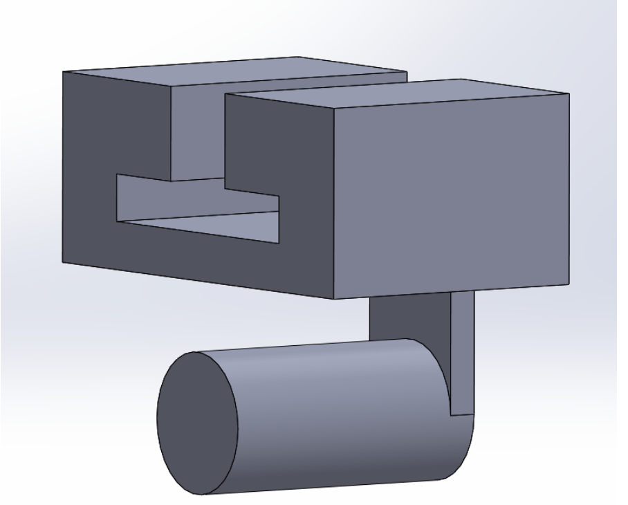

## Analyze
The starting point for this assignment was the strength and stiffness analysis completed in the previous assignment. The calculated dimensions were compared to determine which requirement governed each feature.

The previous analysis showed that the stress requirement governed the final dimensions for Features A through E.

### Final Feature Dimensions
Feature	Stress Requirement	Stiffness Requirement	Final Dimension
A	1.006 in	0.516 in	1.006 in

B	0.133 in	0.0165 in	0.133 in

C	0.133 in	0.0652 in	0.133 in

D	0.053 in	0.0031 in	0.050 in

E	0.053 in	0.0033 in	0.050 in

These values were used as the primary design dimensions for the parametric CAD model.

### Parametric Modeling

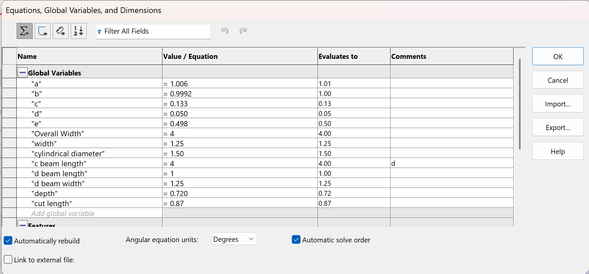

Instead of treating each dimension as an independent value, the important dimensions were set up as parameters in CAD. This allows the model to respond to changes in the design requirements without requiring every feature to be manually remodeled. The parametric table contains the important dimensions used to control the bracket geometry. The parameters include the feature dimensions as well as other important dimensions used to define the bracket and its interface.

### Engineering Equation Used to Drive the Model

One of the dimensions was connected to the engineering analysis rather than simply entering the final calculated value manually.

For Feature A, the strength analysis used the bending-stress relationship:

 <strong>σ = M / Z</strong> 

The allowable stress was determined using the factor of safety:

 <strong>σallow = Sy / SF</strong> 

Using the A36 steel yield strength of 36,000 psi and a factor of safety of 4:

 <strong>σallow = 36,000 / 4</strong> 

 <strong>σallow = 9,000 psi</strong> 

The resulting strength calculation determined that Feature A required a final dimension of:

 <strong>Feature A = 1.006 in</strong> 

This dimension was incorporated into the CAD parameter system so that the model could update when the parameter was changed.

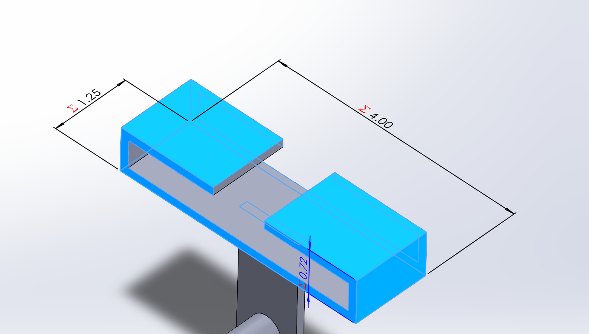

### T-Beam Interface

The updated T-beam specifications were also considered when modeling the bracket. The bracket interface needed to provide the required sliding fit over the rigid T-beam.

The updated T-beam dimensions were:

(a = 0.498) in with a tolerance of (+0.000/-0.001) in

(b = 0.9992) in with a tolerance of (+0.000/-0.0005) in

(c = 1.499) in with a tolerance of (+0.000/-0.001) in

These dimensions were used to determine the corresponding bracket interface geometry and gaps.

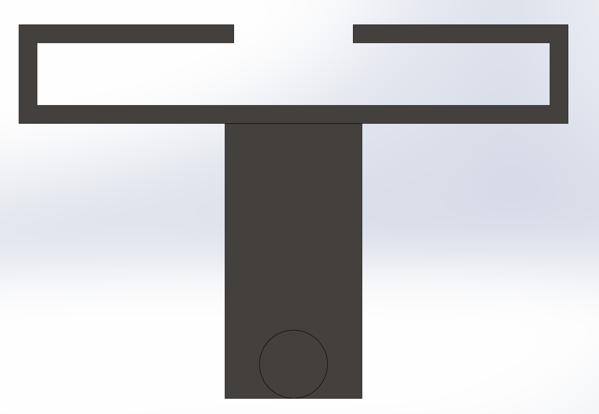

### Modeling Process

The bracket was modeled by creating the primary geometry first and then adding the features required by the design. The dimensions were controlled using the established parameters.

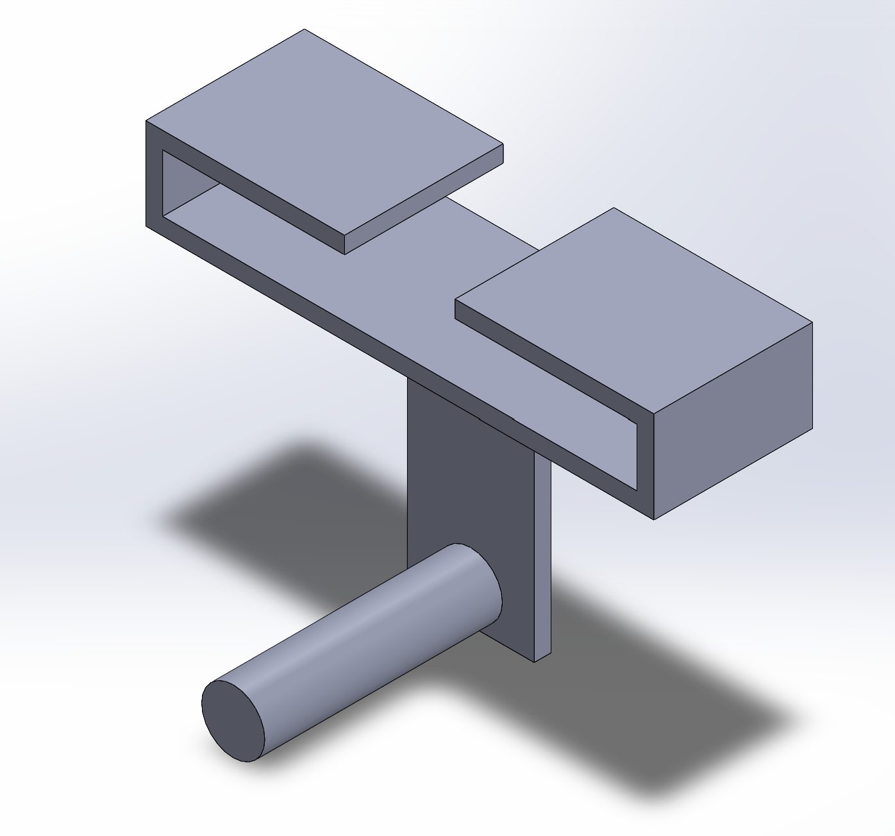

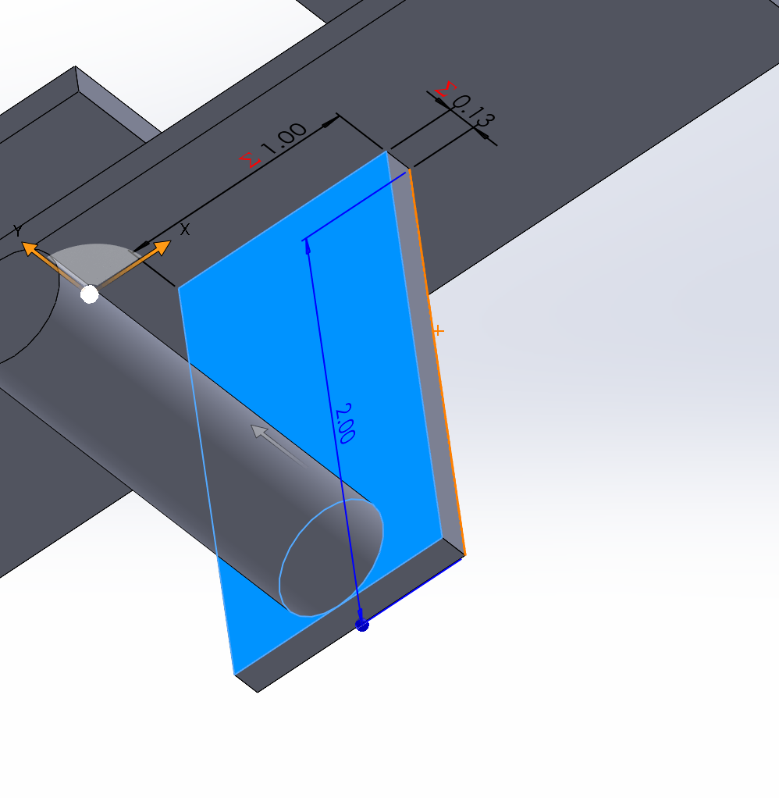

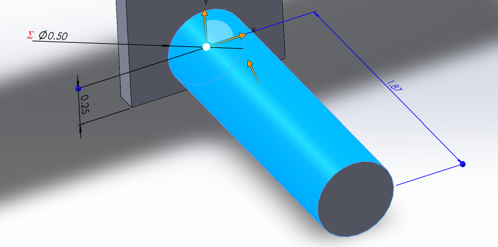

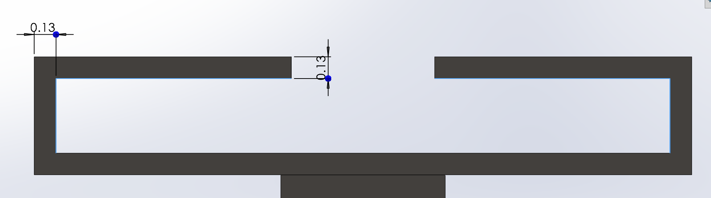

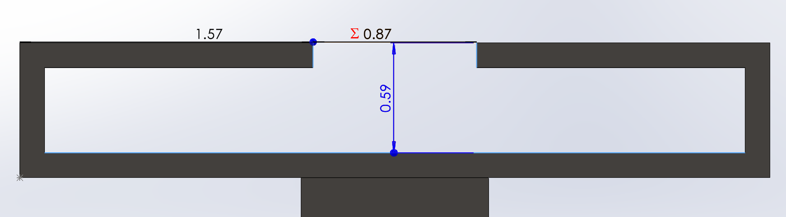

### Design Changes and Mistakes

During the modeling process, I checked the CAD model against the calculated dimensions and the updated T-beam specifications. Any dimensions or features that did not match the requirements were corrected before creating the final drawing. One important consideration was making sure that the updated T-beam specifications were used for the interface rather than relying only on dimensions from the previous design.

## Decide

The final design decisions were based on the results of the previous strength and stiffness analysis and the functional requirements of the bracket.

### Final Design Dimensions

The final dimensions selected for the five analyzed features were:

Feature A = 1.006 in

Feature B = 0.133 in

Feature C = 0.133 in

Feature D = 0.050 in

Feature E = 0.050 in

Stress governed the design for these features because the stress-based dimensions were larger than the dimensions required by the stiffness calculations.

The bracket material was selected as A36 steel, consistent with the previous analysis.

### Tolerancing Decisions

The engineering drawing uses the required general linear tolerance classes:

X.X ± 0.02 in

X.XX ± 0.01 in

X.XXX ± 0.005 in

The tighter tolerances were applied where dimensional accuracy is more important to the function of the bracket, particularly at mating or sliding-fit interfaces. Less critical dimensions can use the looser general tolerance because small variations in those dimensions have less effect on the function of the bracket.

Using a tighter tolerance on every dimension would increase manufacturing and inspection requirements without providing a functional benefit for non-critical features.

### Engineering Drawing

A multi-view engineering drawing was created from the completed parametric model. The drawing uses third-angle projection and includes the dimensions and tolerances needed to communicate the design.

The drawing includes:

Multiple orthographic views

Third-angle projection

Complete dimensional information

Sliding-fit/interface dimensions

General tolerance block

Material information

Title block

Scale

Drawing identification information

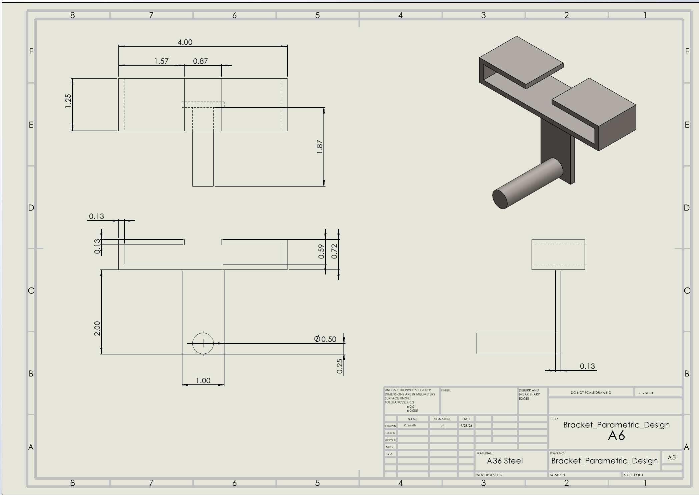

### Drawing Tolerance Block

The general tolerance block was set to:

LINEAR

X.X ± 0.02

X.XX ± 0.01

X.XXX ± 0.005

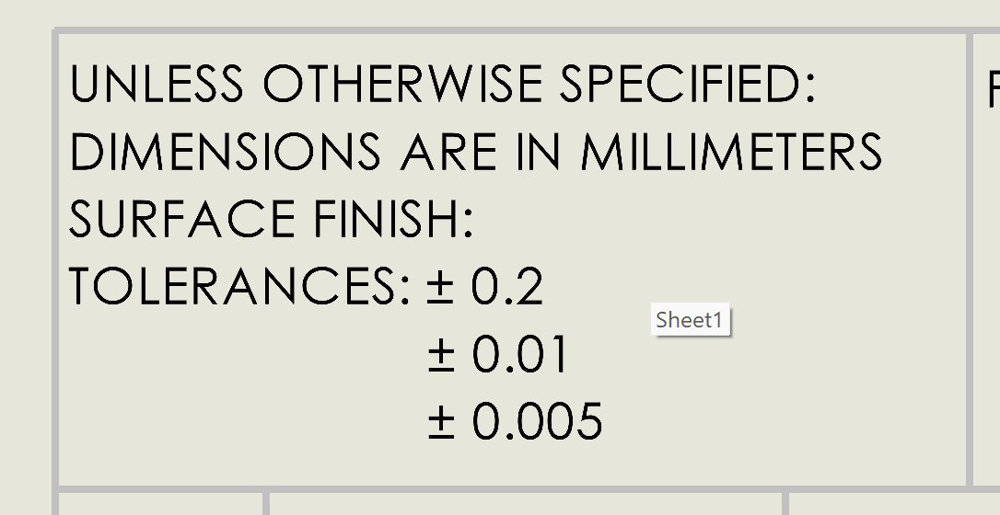

## Communicate

The final design was communicated through the parametric CAD model, engineering drawing, calculations, and documentation of the design process. The completed engineering drawing provides the dimensions, tolerances, views, and material information needed to communicate the design to someone who would manufacture the bracket. The parametric CAD model provides the actual three-dimensional geometry and allows important design dimensions to be changed without rebuilding the entire model manually.

### Final CAD Model

Final Engineering Drawing

### CAD Files

The completed CAD files are provided below so that the model can be downloaded and inspected.

[CAD ZIP File](Bracket_Parametric_Design.zip)]

[CAD Part File](Bracket_Parametric_Design.SLDPRT)]

[CAD Drawing File](Bracket_Parametric_Design.SLDDRW)]
